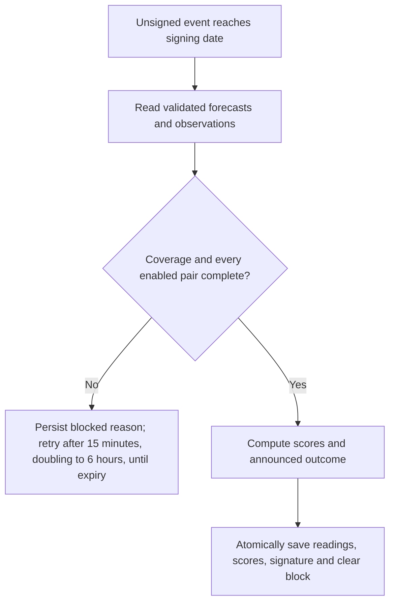

# Settlement data checks

Use this procedure when deploying the forward data validation changes or investigating an unsigned event.
It does not authorize changing a signed outcome or sending a payment.

## Required evidence

Settlement requires validated forecast values issued before the event starts and validated observations covering its requested interval.
The source reader and lifecycle gate perform separate checks.

| Check | Failure behavior |
|---|---|
| Forecast provenance and native intervals | Hold settlement when the baseline cannot be verified. |
| Observation quality and archive readability | Hold settlement when reports with problems affecting the event's metrics are rejected or unverified, or when the archive is unreadable. |
| Station collection coverage | Hold settlement when successful collection intervals leave a gap. |
| Collection after the signing deadline | Hold settlement until a fresh successful request covers the event end. |
| Observation reporting cadence | Hold settlement when usable reports leave a gap exceeding 90 minutes; a window of 12 hours or longer tolerates one gap of up to 150 minutes, but the last report must still fall within 90 minutes of the window end. |
| Enabled station and metric pairs | Hold settlement when a baseline or observation is missing, duplicated, or nonfinite. |

A successful empty source response can establish collection coverage. It does not establish a usable weather value.
All enabled stations and metrics need actual values and adequate reporting cadence before scoring can authorize a signature.
Precipitation remains eligible when its accumulation intervals match the requested scoring window.
METAR routine anchors must establish an hourly cadence between 45 and 75 minutes.
Trace amounts require review. Positive accumulations with unknown or mixed precipitation phase cannot become exact rainfall amounts.
Do not prorate an accumulation or change an announced window to fill a gap.
For positive rainfall, phase checks also require a validated routine report at or after the end, within 75 minutes, and collection coverage from the preceding anchor through that closing report. Late snow or freezing-rain remarks can hold rainfall. The extra reports do not enter temperature, wind, or humidity extrema. An explicit fixed-hour liquid zero can establish zero measurable rain; it cannot establish zero snowfall while phase is unknown.

Routine METAR resets can occur at different minutes from forecast period boundaries.
Validated NWS RR7/SHEF reports supply fixed UTC-hour accumulation intervals at supported stations.
The reader verifies retained products and station mappings before using an exact chain of those intervals.
Phase, trace, collection, and cadence checks still apply. A whole-hour window alone does not guarantee usable precipitation totals.
Check actual native intervals before offering a precipitation event. A future observation schedule is not a guarantee of collection.

Strict humidity compares maximum observed relative humidity with maximum forecast humidity.
Each observed report uses its own temperature and dewpoint in the Magnus formula.
Provisional humidity display statistics remain unchanged.



## Check a window before funding

Call `GET /stations/window-compatibility` with `start`, `end`, and comma-separated `station_ids`.
Use the optional `metrics` parameter to select NOAA metric IDs. Without it, the endpoint checks `temp_high`, `temp_low`, and `wind_speed`.
The request accepts at most 20 distinct stations and a nonempty window of at most seven days.
Times must use RFC 3339. The endpoint rejects unknown parameters and metrics.

```http
GET /stations/window-compatibility?station_ids=KORD&metrics=rain_amt&start=2030-01-01T00:00:00Z&end=2030-01-02T00:00:00Z
```

Replace the example dates with the proposed event window. A request beyond the retained forecast horizon returns unavailable baselines.
The endpoint returns planning evidence without creating or changing an event.

| Response field | Meaning |
|---|---|
| `requested_window` | The exact stations, metrics, and UTC interval evaluated. |
| `evaluated_at` | The time of this planning check. |
| `forecasts[].baseline_available` | The strict forecast assessment currently has a valid value for this metric and interval. |
| `forecasts[].baseline` and `unit` | The value in settlement units; temperatures use Fahrenheit. |
| `forecasts[].reason` | Why the baseline is unavailable. |
| `forecasts[].native_intervals` | Verified native boundaries from the selected forecast publication's horizon. An absent end identifies an instant. |
| `observations` | `pending` for a window that has not ended; otherwise `not_assessed`. |
| `stations[].fixed_hour_precipitation_source` | `recently_observed` when recent verified fixed-hour reports exist; otherwise `unknown`. |
| `precipitation_capability_warning` | A failed optional capability lookup; forecast planning can still continue. |
| `settlement_ready` | Always `false`. This response cannot authorize a signature. |

Native interval names describe source fields. Rainfall lists the relevant water-equivalent, snow, ice, and ratio boundaries.
Choose boundaries compatible with every selected station and metric. Then check the proposed window again.
Do not treat `recently_observed` as a guarantee of future station service.
Do not treat `unknown` as proof that a station is unsupported.

Future forecasts can change before the event starts. Future observations and collection coverage cannot be verified in advance.
The settlement gate must assess the announced interval again after its signing deadline.

## Rollout

1. Publish forecasts with native interval provenance and observation history with collection manifests.
2. Verify that station manifests cover each intended event window without gaps.
3. Verify that the collection lookback exceeds the signing delay plus collection scheduling and request latency.
4. Run the lifecycle, query, ingestion, and database checks before deployment.
5. Inspect the first unsigned events through their signing deadlines.
6. Confirm that blocked events show a reason in both the API and interface.

Existing signed events are excluded from processing. Their scores and signatures remain unchanged.
The final database transaction stores readings, all entry scores, and the signature together.
Concurrent finalizations and delayed provisional updates cannot modify an already signed event.
An unsigned legacy event without verifiable evidence stays blocked until adequate data becomes available.
An unreadable archive must produce an error, not an empty response.

### Observation quality by metric

The daemon tags each rejected or unverified report with the metric groups its problems affect (`quality_metrics`, see [observation ingestion](observation-ingestion.md#report-quality-and-precipitation)).
A report holds an event only when those groups overlap the groups its enabled metrics depend on:

| Metric | Groups |
|---|---|
| `temp_high`, `temp_low` | `temperature` |
| `humidity` | `temperature`, `dewpoint` |
| `wind_speed`, `wind_direction` | `wind` |
| `rain_amt`, `snow_amt` | `precipitation`, `present_weather`, `temperature` |

A rain gauge (`PNO`) or present-weather sensor (`PWINO`) outage therefore holds rain and snow events but not temperature or wind events.
The affected values of a flagged report never enter any aggregate; its other values do. Rain and snow totals are left out of settlement for events that do not score them.
Every group applies, as before per-metric tags existed, when a report has no tags (files written before the column), an unknown or empty tag, missing provenance, or fails the oracle's own screening (units, physical bounds, temperature jumps, conflicting duplicates).
`GET /stations/observation-quality` takes an optional `metrics` list and counts every group without one.

Reports from files that predate the daemon's quality fields (no `quality_status` or `raw_text`) were never checked.
When they are the only unverified reports, settlement fails with a `source_unavailable` block naming them rather than an unverified count; they cannot pass a quality check.

## Inspect a blocked event

Read `GET /oracle/events/{id}` and inspect `settlement_block.code`, `message`, and `checked_at`.
Readings and entry scores on a blocked event can come from an earlier provisional refresh.
Use the reason to select the next action.

| Signal | Action |
|---|---|
| `incomplete_readings` | Check every named station and metric against the requested interval. |
| `data_quality` | Inspect rejected and unverified reports whose problems affect the event's metrics before publishing a reviewed correction. |
| `source_unavailable` | Inspect the reported coverage, forecast, file, or query failure. |
| `processing_failed` | Inspect the event processing log and database writer health. |

The next successful processing pass uses fresh validated readings and recomputes the result.
A blocked event is read again 15 minutes after its first failed check, because new observations arrive hourly.
Each further failure in a row doubles the wait (30 minutes, 1 hour, and so on) up to 6 hours; a successful check ends it.
Its first check after the signing date is never delayed, and failures from before that date do not lengthen later waits.
The count of failures is kept in memory: after a restart a blocked event waits 15 minutes from its stored `checked_at`, then starts over.
Do not clear a block manually to force signing. Clearing a displayed reason cannot repair missing evidence.
An event can remain unsigned through its announced expiry; the coordinator must handle the contract's expiry path.
The oracle stops processing an unsigned event at its announced expiry, one day after the signing date, and keeps its last block reason.
`oracle_events_expired_unsigned` counts such events with entries. `oracle_events_awaiting_attestation` counts only events that can still be signed.
An event that reaches its signing date without entries has no outcome to sign. The next pass closes it: `settled_without_entries_at` is set, `attestation` stays null, its block reason is dropped, and no later pass reads it.
A pass does not read an event before its observation window opens, and refreshes the provisional readings of an open event at most every 15 minutes.

## Reproducibility limit

Published files contain source provenance and collection evidence. Event readings store the aggregate baseline and observation used for scoring.
The forecast reader verifies the retained source document's hash and checks each value against its stored native metadata.
It does not independently reparse that XML document. Producer extraction has separate source-fixture tests.
The event currently does not store the exact selected file hashes and query policy beside its attestation.
Preserve the published archive and processing logs for a detailed replay investigation.
